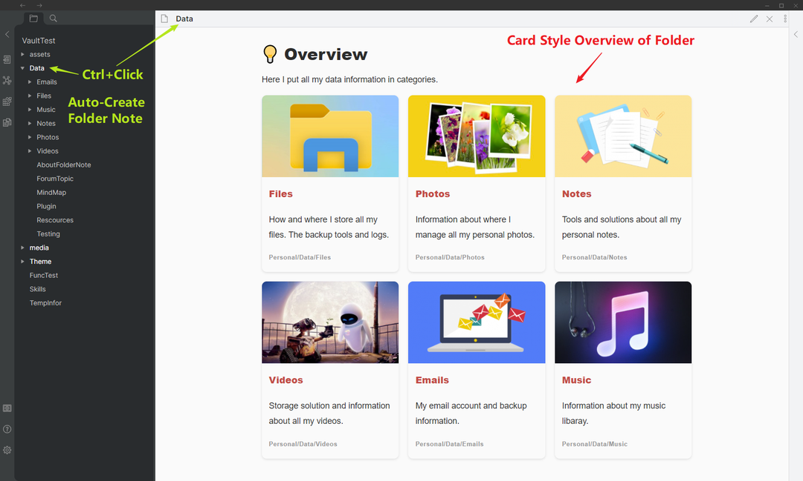

# Folder Note Plugin

Obsidian Plugin: Add description note to a folder. Make your vault to be a hierarchy note system.

## Usage

- **Add** description note for a folder: CTRL+Click on a folder node in the file explorer panel.
- **Show** description note of a folder: Just Click the folder.
- **Delete** description note of a folder: Just delete the opened note file.
- **Configure** : configure the note name and template on the settings panel.

## How it works

Just a simple trick. When create description for a folder, a note file named `_about_.md` will be created in the clicked folder. However, the file `_about_.md` is hidden by CSS rules of the plugin. The reason that the file is hidden because:

- the `_about_.md` file will not always be shown right after the folder node if there are subfolders.
- The file name may looks abnormal or weird.
- In the future, the description will be automatically generated based on the files and their contents in the folder. 

## Settings

- Hide Note: turn off the setting if you want to show the folder note file.
- Note Name: set the folder note name, like `_overview_` or `index`. You can use {{FOLDER_NAME}} to set the note name same as folder, **BUT** it is not recommended, because you have to manually change all the note file name if you rename a folder.
- Note inital content: set the initial content for new folder note.
- {{FOLDER_NAME}} in the content will be replaced with the folder name.
- {{FOLDER_BRIEF}} in the content will be replaced with the folder overview in card view.

## Change log

### 0.3.0

- Automatically generate card-view of folder overview (Experimental).

### 0.2.5

- Fix folder and note name check for hiding.

### 0.2.4

- Add settings option to hide or unhide folder note file.

### 0.2.3

- Fix: failed to create note file when create a new folder.
- Change: change the default note name to \_about\_ because of folder rename problem.

### 0.2.1

- Add: settings tab
- Note name and contents can be configured.

## Plans for future

- Add more template option for generate the inital content.
- Automatic generate brief contents for the folder note file based on contents in the folder, like the software [Trilium](https://github.com/zadam/trilium) does. 

## Known issues

- The folder note file may appear when created. It will be hidden by click the folder again.
- Leave a message on the github repo if you find an issues or want to improve the plugin.

## Install

- On the Obsidian's settings page, browse the third-party plugins and search 'Folder Note', then install.
- Or manully installing: go to the github release page, copy over `main.js`, `styles.css`, `manifest.json` to your vault `VaultFolder/.obsidian/plugins/folder-note-plugin/`.

## Build

- Clone this repo.
- `npm i` or `yarn` to install dependencies
- `npm run dev` to start compilation in watch mode.

## Status

